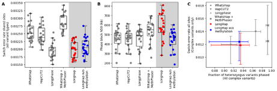
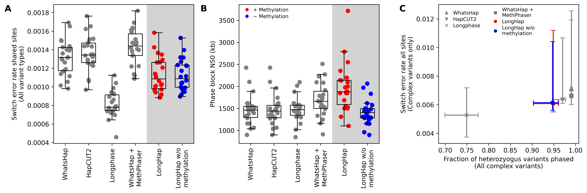
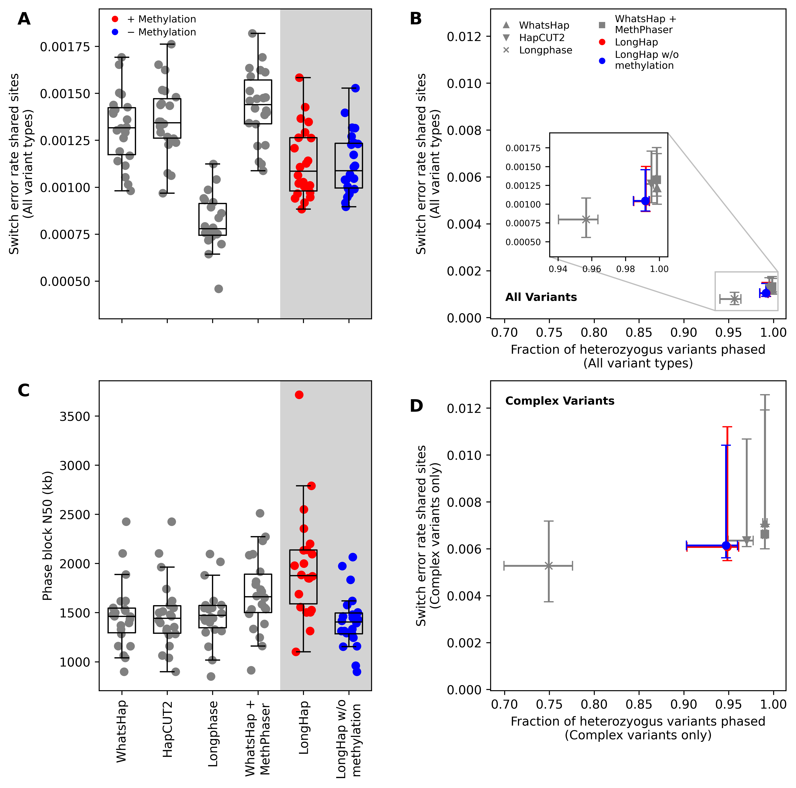

# LongHap

### Table of Contents

- [Description of LongHap](#description-of-longhap)
- [Installation](#installation)
- [Usage](#usage)
- [Outputs](#outputs)
- [Preparation of Inputs](#preparation-of-inputs)
- [Comparison to other phasing tools](#comparison-to-other-phasing-tools)
- [Computational requirements](#computational-requirements)
- [Citation](#citation)
- [Contact](#contact)

### Description of LongHap

LongHap is a read-based variant phasing algorithm that integrates methylation signals native to long-read sequencing data, such as PacBio Revio HiFi and ONT sequencing, into a unified framework. As input, LongHap requires variant calls in VCF format, aligned sequencing reads in BAM format, and, optionally, methylation calls. LongHap then uses a stepwise approach to co-phase SNVs, INDELs, and SVs. First, LongHap phases pairs of variants based on sequence information, embedding complex and low-support variants into the broader haplotype context using graph theory, that is, loopy belief propagation. In a second step, LongHap identifies differentially methylated sites on the fly and leverages them as additional, phase-informative markers to resolve variant pairs that could not be confidently phased based on sequence information alone, extending initially inferred phase blocks. Finally, LongHap outputs a phased VCF and, optionally, haplotagged read alignments and the set of differentially methylated sites used for phasing.

### Installation

LongHap's only requirements are Python >= 3.12 with the following packages installed:
- cyvcf2 >= 0.31.4
- pysam >= 0.23.3
- parasail-python >= 1.3.4
- numpy >= 2.4.1
- pandas >= 2.3.3
- scipy >= 1.17.0
- biopython >= 1.86
- tqdm >= 4.67.1

All Python dependencies can be installed using the provided `longhap.yaml` file with conda:
```commandline
git clone https://github.com/AkeyLab/LongHap.git
cd LongHap/
conda env create -f longhap.yml
conda activate longhap
```

### Usage

LongHap takes the following files as inputs: 
- A VCF file with variant calls
- A BAM file with aligned reads
- Reference fasta file
- (Optional) A BED file with methylation calls

If only a VCF and a BAM file are provided, LongHap will phase variants based on sequence information alone, similarly to WhatsHap, HapCUT2, or LongPhase. If a BED file with methylation calls is provided, LongHap will additionally leverage methylation information to phase variants that could not be phased based on sequence information alone.

#### Variant phasing based on sequence information alone:

```commandline
./LongHap.py \
    --vcf input_variants.vcf \
    --bam aligned.pacbio.bam \
    --reference reference.fasta \
    --chrom chr1 \
    --pacbio \
    -o phased_variants.vcf.gz
```

#### Variant phasing based on sequence and methylation information:

```commandline
./LongHap.py \
    --vcf input_variants.vcf \
    --bam aligned.pacbio.bam \
    --reference reference.fasta \
    --chrom chr1 \
    --methylation_calls methylation_calls.bed \
    --pacbio \
    -o phased_variants.vcf.gz
```

#### General phasing options  

When using ONT data, replace the `--pacbio` flag with `--ont`. When you want to phase SNVs only, add the `--snvs_only` flag. When you want to phase multiallelic variants, add the `--multiallelics` flag.

By default, we exclude SVs > 50000 bp. This threshold can be adjusted with the `--max_allele_length` flag.

To exclude variants with very low support for the minor allele, use the `--min_allele_count` flag. By default, this flag is set to 1, meaning that at least one read must support the minor allele for a variant to be considered for phasing.

To exclude bases covering heterozygous variants with a base quality below a certain threshold, use the `--min_base_quality` flag. This is particularly useful when phasing SNPs from ONT data, where low base qualities may indicate systematic errors. By default, this flag is 0 to consider all bases for PacBio HiFi data and 10 for ONT data.

#### The complete list of options
```
./LongHap.py -h
usage: LongHap.py [-h] --vcf VCF -b BAM -r REFERENCE -c CHROM [-m METHYLATION_CALLS] [--snvs_only] [--multiallelics] 
                  [--ont] [--pacbio] [--max_allele_length MAX_ALLELE_LENGTH] [--min_allele_count MIN_ALLELE_COUNT]
                  [--min_base_quality MIN_BASE_QUALITY] -o OUTPUT_VCF [--output_bam OUTPUT_BAM] [--output_read_assignments OUTPUT_READ_ASSIGNMENTS] 
                  [--output_blocks OUTPUT_BLOCKS] [--output_differentially_methylated_sites OUTPUT_DIFFERENTIALLY_METHYLATED_SITES] 
                  [--output_transition_matrix OUTPUT_TRANSITION_MATRIX] [--output_transition_matrix_meth OUTPUT_TRANSITION_MATRIX_METH] 
                  [--output_read_states OUTPUT_READ_STATES] [--output_variant_read_mapping OUTPUT_VARIANT_READ_MAPPING] 
                  [--output_allele_coverage OUTPUT_ALLELE_COVERAGE] [--output_unphaseable_variants OUTPUT_UNPHASEABLE_VARIANTS]  
                  [--use_all_methylated_sites] [--force] [--log LOG] [-v]

options:
  -h, --help            show this help message and exit
  --vcf VCF             Input VCF with called variants
  -b BAM, --bam BAM     Sorted alignment bam
  -r REFERENCE, --reference REFERENCE
                        Reference fasta
  -c CHROM, --chrom CHROM
                        Chromosome
  -m METHYLATION_CALLS, --methylation_calls METHYLATION_CALLS
                        Methylation calls from pileup model
  --snvs_only           Whether to phase SNVs only ["False]
  --multiallelics       Also phase multiallelic variants or not [False]
  --ont                 Data is Oxford Nanopore data [False]
  --pacbio              Data is PacBio HiFi data [False]
  --max_allele_length MAX_ALLELE_LENGTH
                        Maximum length of alleles to consider for phasing in bp [50000]
  --min_allele_count MIN_ALLELE_COUNT
                        How many examples of the minor allele must be present in the reads to consider the variant for phasing [1]
  --min_base_quality MIN_BASE_QUALITY
                        Minimum base quality to consider a base for phasing. Only affects SNP phasing. For HiFi data, all bases should be consider, that is a minimum quality of 0.
                        For ONT data, a threshold of 10 is recommended [0]
  -o OUTPUT_VCF, --output_vcf OUTPUT_VCF
                        Output phased vcf
  --output_bam OUTPUT_BAM
                        Output haplotagged bam
  --output_read_assignments OUTPUT_READ_ASSIGNMENTS
                        Haplotype assignments for each read
  --output_blocks OUTPUT_BLOCKS
                        Haplotype blocks in bed format
  --output_differentially_methylated_sites OUTPUT_DIFFERENTIALLY_METHYLATED_SITES
                        Write differentially methylated files used by longhap to infer transitions to file
  --output_transition_matrix OUTPUT_TRANSITION_MATRIX
                        If provided transition matrix will be saved to this file as numpy array (.npz). Allows faster re-runs.
  --output_transition_matrix_meth OUTPUT_TRANSITION_MATRIX_METH
                        If provided transition matrix filled in with methylation data will be saved to this file as numpy array (.npz). Allows faster re-runs.
  --output_transition_matrix_pop OUTPUT_TRANSITION_MATRIX_POP
                        If provided transition matrix filled in with population data will be saved to this file as numpy array (.npz). Allows faster re-runs.
  --output_read_states OUTPUT_READ_STATES
                        If provided read states will be saved to this file as json. Allows faster re-runs.
  --output_variant_read_mapping OUTPUT_VARIANT_READ_MAPPING
                        If provided read names covering a specific variant will be saved to this file as json. Allows faster re-runs.
  --output_allele_coverage OUTPUT_ALLELE_COVERAGE
                        If provided allele coverage will be saved to this file as npy (.npy). Sites with one allele absent from reads bill be ignored. Allows faster re-runs.
  --output_unphaseable_variants OUTPUT_UNPHASEABLE_VARIANTS
                        If provided unphaseable variants will be saved to this file as npz. Allows faster re-runs.
  --use_all_methylated_sites
                        Whether to use all methylated sites or not. If False, at most 25,000 methylated sites per transition are used. This guarantees fast runtimes and does not
                        seem to sacrifice accuracy. [False]
  --force               If transition matrix output is provided and file already exists this file will be loaded by default unless --force is set. Then the transition matrix will be
                        re-inferred.
  --log LOG             Log file
  -v, --verbose         Print logging information to stdout
```

### Outputs

LongHap outputs a phased VCF file by default. Optionally, it can also output a haplotagged BAM file, haplotype assignments per read, a BED file with haplotype blocks, methylated sites used for phasing, and various intermediate files that can be used to speed up re-runs (mostly for debugging purposes).

#### Phased VCF 

LongHap stores the phase information in the `GT` field and the phase block coordinates in the `PS` field of the output VCF file. 


```
#CHROM	POS	ID	REF	ALT	QUAL	FILTER	INFO	FORMAT	HG002
chr1	13029010	.	A	T	40	PASS	.	GT:GQ:DP:AD:VAF:PL:PS	1|0:40:28:14,14:0.5:39,0,53:45
chr1	13029690	.	T	C	57.8	PASS	.	GT:GQ:DP:AD:VAF:PL	1/1:54:28:0,28:1:57,56,0
chr1	13030289	.	T	G	57	PASS	.	GT:GQ:DP:AD:VAF:PL	1/1:54:30:0,30:1:56,56,0
chr1	13030367	.	T	C	38.6	PASS	.	GT:GQ:DP:AD:VAF:PL:PS	1|0:38:30:16,14:0.466667:38,0,52:45
chr1	13030751	.	C	CCT	33.4	PASS	.	GT:GQ:DP:AD:VAF:PL:PS	0|1:32:29:14,15:0.517241:33,0,37:45
chr1	13030882	.	T	G	37.6	PASS	.	GT:GQ:DP:AD:VAF:PL:PS	1|0:37:29:15,14:0.482759:37,0,53:45
```

#### Additional outputs

If `--output_blocks` is specified, LongHap will also write the phase block coordinates to the specified BED file.

A haplotagged bam file can be requested using `--output_bam`. In the optional haplotagged BAM file, LongHap adds a custom `HP` tag to each read, indicating the haplotype assignment of the read.

If `--output_read_assignments` is specified, LongHap will write a TSV file with the haplotype assignments for each read. The file has three columns: read name, haplotype assignment (1 or 2), and phase block ID.

### Preparation of Inputs

To leverage methylation information for phasing, LongHap also requires methylation calls in the form of a BED file. Currently, LongHap expects the file to be generated with `aligned_bam_to_cpg_scores` from [pb-cpg-tools](https://github.com/PacificBiosciences/pb-CpG-tools).

A VCF file generated with any variant caller of your choice works. We chose to use [DeepVariant](https://github.com/google/deepvariant) to call small variants and [Sniffles2](https://github.com/fritzsedlazeck/Sniffles) to call large variants. We then merged the calls into one VCF file. **For optimal performance, we recommend that the final VCF file is left-aligned and multiallelic sites are merged, using `bcftools norm -m+`.**

For the BAM file, we recommend using [minimap2](https://github.com/lh3/minimap2) to align the reads to the reference genome, but any aligner will do. **If you want to harness methylation information, make sure to use an aligner that preserves the necessary tags, that is, `MM` and `ML` tags.** For exampl, starting from a raw PacBio HiFi BAM file and using minimap2 this can be achieved like this:
```commandline
samtools fastq -T 'ML,MM' raw.pacbio.bam > raw.pacbio.fastq
minimap2 -ax map-hifi -y reference.fasta raw.pacbio.fastq
```
The `-y` flag tells minimap2 to retain the tags present in the fastq file. 

### Comparison to other phasing tools

We benchmarked LongHap and other tools on HG002, using publicly available PacBio HiFi, ONT, and UL-ONT data. We find that LongHap generally outperforms all other tools. LongHap's integration of methylation information yields larger phasing improvements that MethPhaser - a recent tool that attempts to refine the phasing by another tool (e.g., WhatsHap) using methylation information, while also creating little computational overhead. For ONT data, LongPhase usually achieves lower switch error rate  by avoiding to phase "difficult" variants. LongHap's comprehensive embedding of SVs also allows it to phase them with greater accuracy than other tools.

#### PacBio HiFi data (38x coverage, Read length N50: 18 kb)
LongHap achieves a switch error rate as low as LongPhase (A), while also achieving longer phase blocks when using methylation information (B). LongHap's also phases more SVs with great accuracy (C).



#### ONT R10.4.1 Dorado base calling data (45x coverage, Read length N50: 29 kb)
LongHap achieves a lower switch error rate than WhatsHap and HapCUT2, but slightly higher than LongPhase (A). However, LongHap phases significantly more variants and achieves longer phase blocks when using methylation information (B & C).



#### UL-ONT R10.4.1 Dorado base calling data (44x coverage, Read length N50: 111 kb)
LongHap achieves a lower switch error rate than WhatsHap and HapCUT2, but higher than LongPhase (A). However, LongHap phases significantly more variants and achieves longer phase blocks when using methylation information (B & C).





### Computational requirements

LongHap phases in <15 minutes using a single thread and <8 Gb of memory. The exact requirements depend on sequencing coverage, the number of heterozygous variants, density of structural variants that require local realignment, and density of methylated sites.
Below we provide the run times for phasing chromosome 1 of HG002 using PacBio HiFi, ONT, and UL-ONT data.

| Data type     | Coverage | Read length N50 | LongHap Mode | Time (hh:mm:ss) | Memory (Gb) |
|---------------|----------|------------------|--------------|-----------------|-------------|
| PacBio HiFi   | 38x      | 18 kb           | Sequence only | 00:04:52        | 2.1         |
| PacBio HiFi   | 38x      | 18 kb           | Sequence + Methylation | 00:07:39        | 6.5         |
| ONT R10.4.1   | 45x      | 29 kb           | Sequence only | 00:15:21        | 2.5         |
| ONT R10.4.1   | 45x      | 29 kb           | Sequence + Methylation | 00:26:10        | 2.5         |
| UL-ONT R10.4.1| 44x      | 111 kb          | Sequence only | 00:20:52        | 2.2         |
| UL-ONT R10.4.1| 44x      | 111 kb          | Sequence + Methylation | 00:19:36        | 2.9         |

### Citation

### Contact

Aaron Pfennig, apfennig at princeton.edu