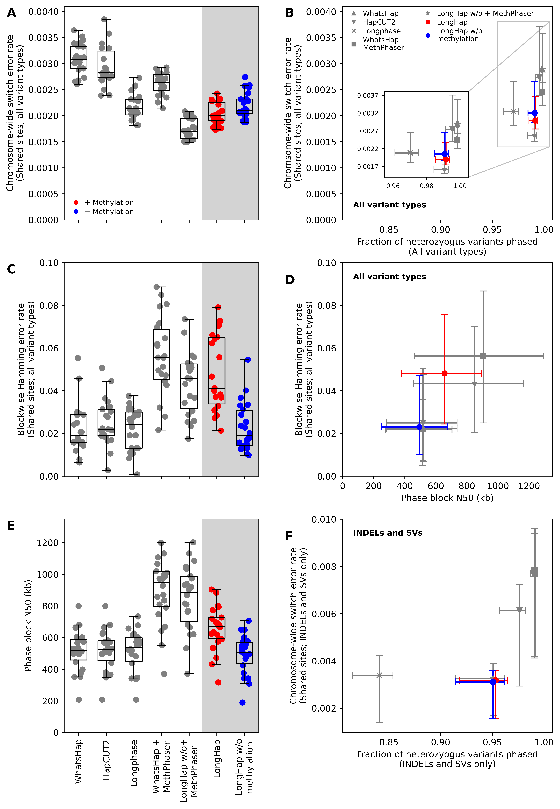
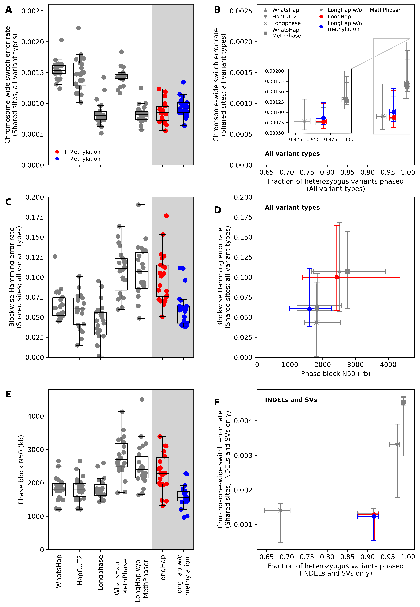
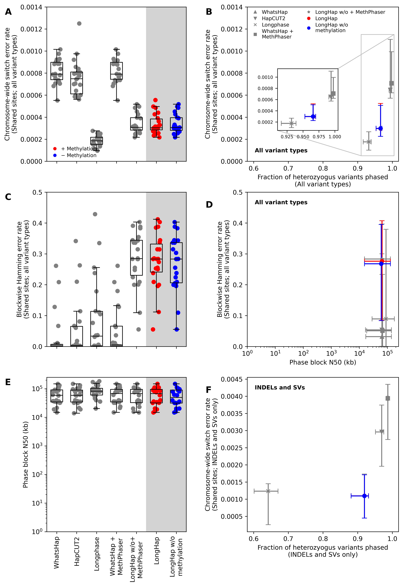

# LongHap

### Table of Contents

- [Description of LongHap](#description-of-longhap)
- [Installation](#installation)
- [Exemplary Usage](#exemplary-usage)
- [Outputs](#outputs)
- [Preparation of Inputs](#preparation-of-inputs)
- [Comparison to other phasing tools](#comparison-to-other-phasing-tools)
- [Computational requirements](#computational-requirements)
- [Citation](#citation)
- [AI disclaimer](#ai-disclaimer)
- [Contact](#contact)

### Description of LongHap

LongHap is a read-based variant phasing algorithm that integrates methylation signals native to long-read sequencing data, such as PacBio Revio HiFi and ONT sequencing, into a unified framework. As input, LongHap requires variant calls in VCF format, aligned sequencing reads in BAM format, and, optionally, methylation calls. LongHap then uses a stepwise approach to co-phase SNVs, INDELs, and SVs. First, LongHap phases pairs of variants based on sequence information, embedding complex and low-support variants into the broader haplotype context using graph theory, that is, loopy belief propagation. In a second step, LongHap identifies differentially methylated sites on the fly and leverages them as additional, phase-informative markers to resolve variant pairs that could not be confidently phased based on sequence information alone, extending initially inferred phase blocks. Finally, LongHap outputs a phased VCF and, optionally, haplotagged read alignments and the set of differentially methylated sites used for phasing.

### Installation

<details open>
    
<summary>Install with <code>pip</code></summary>
    
```commandline
pip install longhap
longhap --help
```
</details>

<details>
<summary>or install with <code>uv</code></summary>
    
```commandline
uv tool install longhap
longhap --help
```
</details>

<details>
<summary> or <code>git clone</code> and install locally</summary>
    
```commandline
git clone https://github.com/AkeyLab/LongHap.git
cd LongHap/
pip install -e .
longhap --help
```
</details>

### Requirements

LongHap's only requirements are Python >= 3.11 with the following packages installed:
- cyvcf2 >= 0.31.4
- pysam >= 0.23.3
- parasail-python >= 1.3.4
- numpy >= 2.4.1
- pandas >= 2.3.3
- pyarrow >= 22.0.0
- scipy >= 1.17.0
- pyfaidx >= 0.9.0.3
- tqdm >= 4.67.1

<details>
<summary>Note for Apple Silicon and other ARM users</summary>

`parasail` publishes no wheel for Apple Silicon
(`macosx_*_arm64`) or `linux-aarch64`, so pip needs to build it from source on
those platforms and requires GNU autotools. 

On macOS (Apple Silicon):
```commandline
brew install autoconf automake libtool
```

The github actions CI shows this working on `macos-latest`.
</details>

### Exemplary Usage

LongHap takes the following files as inputs:
- A VCF file with variant calls
- A BAM file with aligned reads
- Reference fasta file
- (Optional) A BED file with methylation calls

If only a VCF and a BAM file are provided, LongHap will phase variants based on
sequence information alone, similarly to WhatsHap, HapCUT2, or LongPhase. If a
BED file with methylation calls is provided, LongHap will additionally leverage
methylation information to phase variants that could not be phased based on
sequence information alone.

#### Fetching the example data

We provide toy data for chromosome 1 (chr1:10,000,000-15,000,000) of HG002 to
try out LongHap. If you cloned the repository, the data is already in the
`example/` directory. Otherwise, download it from the latest release into an
`example/` sub-directory of your current working directory:

```commandline
wget -qO- https://github.com/AkeyLab/LongHap/releases/latest/download/example.tar.gz | tar -xz
```

#### Variant phasing based on sequence information alone:

You can run LongHap on the example data like this :

```commandline
longhap \
    --vcf example/deepvariant.vcf.gz \
    --bam example/pacbio.bam \
    --reference example/toy_reference.fa \
    --chrom chr1 \
    --pacbio \
    -o example/phased_variants.vcf.gz \
    --verbose
```

#### Variant phasing based on sequence and methylation information:

Methylation data can be used for phasing with the `--methylation_calls` flag :

```commandline
longhap \
    --vcf example/deepvariant.vcf.gz \
    --bam example/pacbio.bam \
    --methylation_calls example/methylation.bed \
    --reference example/toy_reference.fa \
    --chrom chr1 \
    --pacbio \
    -o example/phased_variants.vcf.gz \
    --verbose
```


### General phasing options  

When using ONT data, replace the `--pacbio` flag with `--ont`. When you want to phase SNVs only, add the `--snvs_only` flag. When you want to phase multiallelic variants, add the `--multiallelics` flag.

By default, we exclude SVs > 50000 bp. This threshold can be adjusted with the `--max_allele_length` flag.

To exclude variants with very low support for the minor allele, use the `--min_allele_count` and `--min_allele_count_meth` flags. By default, these flag are set to 1 and 2, meaning that at least the minor allele for a variant must be supported 1 and 2 reads to be considered for phasing and methylation phasing, respectively.

To exclude bases covering heterozygous variants with a base quality below a certain threshold, use the `--min_base_quality` flag. This is particularly useful when phasing SNPs from ONT data, where low base qualities may indicate systematic errors. By default, this flag is 0 to consider all bases for PacBio HiFi data and 10 for ONT data.

When phasing a multi-sample VCF, LongHap phases the first sample by default. Use the `--sample` flag to select a different one by name.

The `--llr_thresh` flag sets the log-likelihood ratio threshold used for two decisions: whether a CpG site is confidently methylated or unmethylated on a haplotype, and whether a read can be assigned to a haplotype from its methylation pattern or from its allelic states. It defaults to 3, i.e. odds of 1000:1. Raising it makes both decisions more conservative — fewer sites are called differentially methylated and fewer reads are haplotagged, so LongHap connects fewer phase blocks but is more confident in the ones it does connect. Note that this is a threshold on a likelihood *ratio*, so it does not need to be retuned as coverage changes.

The `--error_rate` flag sets the per-base sequencing error rate assumed when haplotagging reads against the inferred haplotypes. The default of 1e-3 suits PacBio HiFi data; a higher value is appropriate for noisier data and makes individual base mismatches count for less when assigning a read.

The `--max_meth_distance` flag sets how far either side of an ambiguous transition LongHap searches the CpG pileup for informative sites, in bp[5000]. Widening it lets the methylation step reach further to bridge a gap, at the cost of runtime and memory, since more candidate sites are scored per transition. Note that methylation can only bridge a junction when reads from*both* sides overlap a shared differentially methylated site, so widening this window does not help across a genuinely read-free gap.

To require more support for the minor allele specifically when methylation information is used, set `--min_allele_count_meth` [2]. This is applied on top of `--min_allele_count` and gates whether a methylation-derived transition is written at all.

#### The complete list of options
```
longhap -h
usage: longhap [-h] [--version] --vcf VCF -b BAM -r REFERENCE -c CHROM [-m METHYLATION_CALLS] [--snvs_only] [--multiallelics] [--ont] [--pacbio] [--max_allele_length MAX_ALLELE_LENGTH]
                  [--min_allele_count MIN_ALLELE_COUNT] [--min_allele_count_meth MIN_ALLELE_COUNT_METH] [--min_base_quality MIN_BASE_QUALITY] [--min_mapq MIN_MAPQ] [--sample SAMPLE]
                  [--llr_thresh LLR_THRESH] [--error_rate ERROR_RATE] [--max_meth_distance MAX_METH_DISTANCE] -o OUTPUT_VCF [--output_bam OUTPUT_BAM]
                  [--output_read_assignments OUTPUT_READ_ASSIGNMENTS] [--output_blocks OUTPUT_BLOCKS] [--output_transition_matrix OUTPUT_TRANSITION_MATRIX]
                  [--output_transition_matrix_meth OUTPUT_TRANSITION_MATRIX_METH] [--output_read_states OUTPUT_READ_STATES] [--output_variant_read_mapping OUTPUT_VARIANT_READ_MAPPING]
                  [--output_allele_coverage OUTPUT_ALLELE_COVERAGE] [--output_unphaseable_variants OUTPUT_UNPHASEABLE_VARIANTS]
                  [--output_differentially_methylated_sites OUTPUT_DIFFERENTIALLY_METHYLATED_SITES] [--use_all_methylated_sites] [--force] [--log LOG] [-v]

options:
  -h, --help            show this help message and exit
  --vcf VCF             Input VCF with called variants
  -b BAM, --bam BAM     Sorted alignment bam
  -r REFERENCE, --reference REFERENCE
                        Reference fasta. Must be indexed with samtools faidx.
  -c CHROM, --chrom CHROM
                        Chromosome
  -m METHYLATION_CALLS, --methylation_calls METHYLATION_CALLS
                        Methylation calls from pileup model
  --snvs_only           Whether to phase SNVs only ["False]
  --multiallelics       Also phase multiallelic variants or not [False]
  --ont                 Data is Oxford Nanopore data [False]
  --pacbio              Data is PacBio HiFi data [False]
  --max_allele_length MAX_ALLELE_LENGTH
                        Maximum length of alleles to consider for phasing in bp [50000]
  --min_allele_count MIN_ALLELE_COUNT
                        How many examples of the minor allele must be present in the reads to consider the variant for phasing [1]
--min_allele_count_meth MIN_ALLELE_COUNT_METH
                        How many examples of the minor allele must be present in the reads to consider the variant for methylation phasing [2]
  --min_base_quality MIN_BASE_QUALITY
                        Minimum base quality to consider a base for phasing. Only affects SNP phasing. For HiFi data, all bases should be consider, that is a minimum quality of 0. For ONT data, a threshold of 10 is recommended
                        [0]
  --min_mapq MIN_MAPQ   Minimum mapping quality to consider a read for phasing [20]
  --min_allele_count_meth MIN_ALLELE_COUNT_METH
                        How many examples of the minor allele must be present in the reads to consider the variant for methylation phasing [2]
  --sample SAMPLE       Sample to phase in a multi-sample VCF [first sample]
  --llr_thresh LLR_THRESH
                        Log-likelihood ratio threshold for determining methylation states, and read haplotagging [3]
  --error_rate ERROR_RATE
                        Per-base error rate assumed when haplotagging reads [1e-3]
  --max_meth_distance MAX_METH_DISTANCE
                        Search window around an uncertain transition for methylation calls [5000]
  -o OUTPUT_VCF, --output_vcf OUTPUT_VCF
                        Output phased vcf
  --output_bam OUTPUT_BAM
                        Output haplotagged bam
  --output_read_assignments OUTPUT_READ_ASSIGNMENTS
                        Haplotype assignments for each read
  --output_blocks OUTPUT_BLOCKS
                        Haplotype blocks in bed format
  --output_transition_matrix OUTPUT_TRANSITION_MATRIX
                        If provided transition matrix will be saved to this file as numpy array (.npz). Allows faster re-runs.
  --output_transition_matrix_meth OUTPUT_TRANSITION_MATRIX_METH
                        If provided transition matrix filled in with methylation data will be saved to this file as numpy array (.npz). Allows faster re-runs.
  --output_read_states OUTPUT_READ_STATES
                        If provided read states will be saved to this file as json. Allows faster re-runs.
  --output_variant_read_mapping OUTPUT_VARIANT_READ_MAPPING
                        If provided read names covering a specific variant will be saved to this file as json. Allows faster re-runs.
  --output_allele_coverage OUTPUT_ALLELE_COVERAGE
                        If provided allele coverage will be saved to this file as npy (.npy). Sites with one allele absent from reads bill be ignored. Allows faster re-runs.
  --output_unphaseable_variants OUTPUT_UNPHASEABLE_VARIANTS
                        If provided unphaseable variants will be saved to this file as npz. Allows faster re-runs.
  --output_differentially_methylated_sites OUTPUT_DIFFERENTIALLY_METHYLATED_SITES
                        Write differentially methylated files used by longhap to infer transitions to file
  --use_all_methylated_sites
                        Whether to use all methylated sites or not. If False, at most 25,000 methylated sites per transition are used. This guarantees fast runtimes and does not seem to sacrifice accuracy. [False]
  --force               If transition matrix output is provided and file already exists this file will be loaded by default unless --force is set. Then the transition matrix will be re-inferred.
  --log LOG             Log file
  -v, --verbose         Print logging information to stdout
```

### Outputs

LongHap outputs a phased VCF file by default. Optionally, it can also output a haplotagged BAM file, haplotype assignments per read, a BED file with haplotype blocks, methylated sites used for phasing, and various intermediate files that can be used to speed up re-runs (mostly for debugging purposes).

#### Phased VCF 

LongHap stores the phase information in the `GT` field and the phase block coordinates in the `PS` field of the output VCF file. 


```
#CHROM	POS	ID	REF	ALT	QUAL	FILTER	INFO	FORMAT	default
chr1	13029010	.	A	T	40	PASS	.	GT:GQ:DP:AD:VAF:MID:PL:PS	1|0:40:28:14,14:0.5:small_model:39,0,53:14
chr1	13029690	.	T	C	57.8	PASS	.	GT:GQ:DP:AD:VAF:MID:PL	1/1:54:28:0,28:1:small_model:57,56,0
chr1	13030289	.	T	G	57	PASS	.	GT:GQ:DP:AD:VAF:MID:PL	1/1:54:30:0,30:1:small_model:56,56,0
chr1	13030367	.	T	C	38.6	PASS	.	GT:GQ:DP:AD:VAF:MID:PL:PS	1|0:38:30:16,14:0.466667:small_model:38,0,52:14
chr1	13030751	.	C	CCT	33.4	PASS	.	GT:GQ:DP:AD:VAF:MID:PL:PS	0|1:32:29:14,15:0.517241:small_model:33,0,37:14
chr1	13030882	.	T	G	37.6	PASS	.	GT:GQ:DP:AD:VAF:MID:PL:PS	1|0:37:29:15,14:0.482759:small_model:37,0,53:14
```

#### Additional outputs

If `--output_blocks` is specified, LongHap will also write the phase block coordinates to the specified BED file.

A haplotagged bam file can be requested using `--output_bam`. In the optional haplotagged BAM file, LongHap adds a custom `HP` tag to each read, indicating the haplotype assignment of the read.

If `--output_read_assignments` is specified, LongHap will write a TSV file with the haplotype assignments for each read. The file has three columns: read name, haplotype assignment (1 or 2), and phase block ID.

### Preparation of Inputs

To leverage methylation information for phasing, LongHap also requires methylation calls in the form of a BED file. Currently, LongHap expects the file to be generated with `aligned_bam_to_cpg_scores` from [pb-cpg-tools](https://github.com/PacificBiosciences/pb-CpG-tools), with the first seven rows being skipped as they are comments.

A VCF file generated with any variant caller of your choice works. We chose to use [DeepVariant](https://github.com/google/deepvariant) to call small variants and [Sniffles2](https://github.com/fritzsedlazeck/Sniffles) to call large variants. We then merged the calls into one VCF file. **For optimal performance, we recommend that the final VCF file is left-aligned and multiallelic sites are merged, using `bcftools norm -m+`.**

For the BAM file, we recommend using [minimap2](https://github.com/lh3/minimap2) to align the reads to the reference genome, but any aligner will do. **If you want to harness methylation information, make sure to use an aligner that preserves the necessary tags, that is, `MM` and `ML` tags.** For exampl, starting from a raw PacBio HiFi BAM file and using minimap2 this can be achieved like this:
```commandline
samtools fastq -T 'ML,MM' raw.pacbio.bam > raw.pacbio.fastq
minimap2 -ax map-hifi -y reference.fasta raw.pacbio.fastq
```
The `-y` flag tells minimap2 to retain the tags present in the fastq file. 

### Comparison to other phasing tools

We benchmarked LongHap and other tools on HG002, using publicly available PacBio HiFi, ONT, and UL-ONT data. We find that LongHap generally outperforms all other tools. LongHap's integration of methylation information yields larger phasing improvements that MethPhaser - a recent tool that attempts to refine the phasing by another tool (e.g., WhatsHap) using methylation information, while also creating little computational overhead. For ONT data, LongPhase usually achieves lower switch error rate  by avoiding to phase "difficult" variants. LongHap's comprehensive embedding of SVs also allows it to phase them with greater accuracy than other tools.

#### PacBio HiFi data (38x coverage, Read length N50: 18 kb)
LongHap achieves a switch error rate as low as LongPhase (A), while also phasing a larger fraction of sites (B) and achieving longer phase blocks when using methylation information (C). LongHap's also phases more SVs with great accuracy (D).



#### ONT R10.4.1 Dorado base calling data (45x coverage, Read length N50: 29 kb)
LongHap achieves a lower switch error rate than WhatsHap and HapCUT2, but slightly higher than LongPhase (A). However, LongHap phases significantly more variants and achieves longer phase blocks when using methylation information (B - D).



#### UL-ONT R10.4.1 Dorado base calling data (44x coverage, Read length N50: 111 kb)
LongHap achieves a lower switch error rate than WhatsHap and HapCUT2, but higher than LongPhase (A). However, LongHap phases significantly more variants and achieves longer phase blocks when using methylation information (B - D).





### Computational requirements

LongHap phases in <35 minutes using a single thread and <10 Gb of memory. The exact requirements depend on sequencing coverage, the number of heterozygous variants, density of structural variants that require local realignment, and density of methylated sites.
Below we provide the run times for phasing chromosome 1 of HG002 using PacBio HiFi, ONT, and UL-ONT data.

| Data type     | Coverage | Read length N50 | LongHap Mode | Time (hh:mm:ss) | Memory (Gb) |
|---------------|----------|------------------|--------------|-----------------|-------------|
| PacBio HiFi   | 38x      | 18 kb           | Sequence only | 00:04:18        | 1.2         |
| PacBio HiFi   | 38x      | 18 kb           | Sequence + Methylation | 00:06:11        | 6.1         |
| ONT R10.4.1   | 45x      | 29 kb           | Sequence only | 00:15:47        | 1.5         |
| ONT R10.4.1   | 45x      | 29 kb           | Sequence + Methylation | 00:33:36        | 6.4         |
| UL-ONT R10.4.1| 44x      | 111 kb          | Sequence only | 00:16:06        | 1.3         |
| UL-ONT R10.4.1| 44x      | 111 kb          | Sequence + Methylation | 00:17:43        | 7.2         |

### Citation

Aaron Pfennig and Joshua M. Akey, Methylation-aware long-read phasing significantly improves genome-wide haplotype reconstruction, *bioRxiv*, 2026, [https://doi.org/10.64898/2026.03.11.710820](https://doi.org/10.64898/2026.03.11.710820)

### AI disclaimer

The idea and initial versions of LongHap were produced entirely by Aaron Pfennig. Claude Code was used to surface bugs and generate a wrapper script to evaluate phasing accuracy. While reviewed and tested by human developers, the software is provided 'as is,' without warranty of any kind.

### Contact

Aaron Pfennig, apfennig at princeton.edu


CHANGES:

Two major changes dominate this merge; the rest are minor fixes

1. Read assignment compared a *summed* log10 likelihood against log10(0.5), a single-site threshold, so no read was ever assigned and the loop exited on its first pass. The same scale error gated site-level state calling, where it also got stricter as coverage grew (unsatisfiable above ~14 reads/haplotype at ml=0.95). Both now use a scale-free likelihood ratio against --llr_thresh, and site states are tri-state (methylated / unmethylated / undetermined), which is what the >= 0 guards in diff_meth always expected. Sites with no calls in a haplotype are no longer  silently treated as unmethylated.

2. Local realignment removed as it systematically inflated the flip error rate. This removes realign_around_variant, get_adaptive_gap_penalties,  is_homopolymer, --flank_snv/--flank_indel and the parasail dependency.

Minor fixes
-----------
* supplementary alignments are now filtered: they double-counted coverage and clobbered read_states, which is keyed by query name
* CIGAR ops 3 (N), 5 (H) and 6 (P) advanced no offset yet were treated as reference-spanning, so a following indel was stepped over
* a degenerate insertion alignment (q_after <= qpos) fell through to a confident REF call
* on LV VCFs write_phased_vcf lacked the split-variant skip that get_heterozygous_variants applies, so output genotypes slipped out of register from the first split site onward
* mirror_transition wrote through its argument; loopy_belief_propagation passes a view, so building the belief graph rewrote transition_matrix
* np.all(t) == 0.5 is always False -- two connect_phase_blocks fallbacks were dead; float comparisons against 0.5 now use np.allclose
* the ONT strand filter divided 0/0 and nan == 0 is False, so variants with no coverage were the ones *not* marked unphaseable; it now also composes with existing unphaseable variants instead of replacing them
* new_t1 row 1 shared a denominator that multiplied where it should add
* methylation read assignments recorded phaseable offsets as variant indices, and a state belonging to the wrong variant
* get_methylation_based_haplotag returned H1 for an unknown read via a vacuous empty-array comparison
* per-haplotype methylation ratio divided by zero coverage
* PS is the position of the block's first variant, matching whatshap, HapCUT2 and longphase, instead of a sequential counter from 0
* --output_* numpy cache paths are normalised to .npz so the reuse check looks where the file is actually written
* --sample, --llr_thresh, --error_rate, --max_meth_distance and --min_allele_count_meth are reachable from the CLI
* dropped the tqdm total that walked the whole chromosome a second time
* removed unused NestedDict and a duplicated edges.append

Adds tests/, a hermetic pytest suite (112 tests, ~13 s) that builds its own reference, VCF and BAM with pysam and needs no external data. The CIGAR walker is checked against pysam.get_aligned_pairs as an independent oracle.
